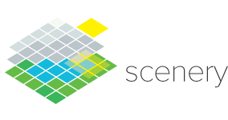

[](./artwork/logo-light.png)  

[](https://maven-badges.herokuapp.com/maven-central/graphics.scenery/scenery) 
[](https://zenodo.org/badge/latestdoi/49890276)
[](https://imagesc.zulipchat.com/#narrow/stream/327495-scenery.2Bsciview) 


[](https://gitlab.com/hzdr/crp/scenery/-/commits/master)
[](https://github.com/scenerygraphics/scenery/actions/workflows/build.yml)
[](https://www.codacy.com/gh/scenerygraphics/scenery/dashboard?utm_source=github.com&amp;utm_medium=referral&amp;utm_content=scenerygraphics/scenery&amp;utm_campaign=Badge_Grade)

# scenery  // Flexible VR Visualisation for Volumetric and Geometric Data on the Java VM


[BloodCellsExample](./src/test/kotlin/graphics/scenery/tests/examples/advanced/BloodCellsExample.kt) / [scenery running on a CAVE](./src/test/kotlin/graphics/scenery/tests/examples/cluster/DemoReelExample.kt) with a scientist exploring a Drosophila melanogaster microscopy dataset / [Adaptive Particle Representation](https://www.nature.com/articles/s41467-018-07390-9) rendering of Zebrafish head vasculature / [Rendering six different out-of-core volumes from two datasets in a single scene](./src/test/kotlin/graphics/scenery/tests/examples/bdv/BDVExample.kt) / VR interaction with microscopy data in realtime


## Synopsis

scenery is a scenegraphing and rendering library. It allows you to quickly create high-quality 3D visualisations based on mesh data. scenery contains both a OpenGL 4.1 and Vulkan renderer. The rendering pipelines of both renderers are configurable using YAML files, so it's easy to switch between e.g. [Forward Shading](./src/main/resources/graphics/scenery/backends/ForwardShading.yml) and [Deferred Shading](./src/main/resources/graphics/scenery/backends/DeferredShading.yml), as well as [stereo rendering](./src/main/resources/graphics/scenery/backends/DeferredShadingStereo.yml). Rendering pipelines can be switched on-the-fly.

Both renderers support rendering to head-mounted VR goggles like the HTC Vive or Oculus Rift via [OpenVR/SteamVR](https://github.com/ValveSoftware/openvr).

## Examples

Have a look in the [src/test/kotlin/graphics/scenery/tests/examples](./src/test/tests/graphics/scenery/tests/examples/) directory, there you'll find plenty of examples how to use _scenery_ in Kotlin, and a few Java examples.

Some of the examples need additional meshes, which are not part of the repository due to their size. These meshes can be downloaded [here](https://ulrik.is/scenery-demo-models.zip) and extracted to a directory of choice. When running the examples, the environment variable `SCENERY_DEMO_FILES` should point to this directory, otherwise the models will not be loaded and scenery will complain.

## Contributed examples

* Scala - [@Sciss](https://github.com/Sciss) has translated the Kotlin and Java examples to Scala, [https://github.com/Sciss/SceneryScalaExamples](https://github.com/Sciss/SceneryScalaExamples)

## Documentation

Documentation for scenery is published at [docs.scenery.graphics/scenery/](https://docs.scenery.graphics/scenery/), but is in a very minimal state at the moment. Contributions are very welcome! The documentation is created using [Gitbook](https://www.gitbook.com/), and the corresponding repository can be found at [github.com/scenerygraphics/scenery-docs/](https://github.com/scenerygraphics/scenery-docs/).

## Citation

In case you use scenery in a scientific publication, please cite this paper:

* Ulrik Günther, Tobias Pietzsch, Aryaman Gupta, Kyle I.S. Harrington, Pavel Tomancak, Stefan Gumhold, and Ivo F. Sbalzarini: scenery — Flexible Virtual Reality Visualisation on the Java VM. _IEEE VIS 2019 (DOI: [10.1109/VISUAL.2019.8933605](https://doi.org/10.1109/VISUAL.2019.8933605), Preprint: [arXiv:1906.06726](https://arxiv.org/abs/1906.06726))_.

If you want to refer to a specific scenery version, e.g. for reproducibility, also can additionally cite the [DOI of the scenery version you used](https://zenodo.org/record/3228395).

## Default Key bindings

Most of the demos use the following key bindings:

### Movement

| Key | Action |
| --- | --- |
| Mouse drag | Look-around |
| `W, A, S, D` | Move forward, left, back, right |
| `Shift` - `W, A, S, D` | Move forward, left, back, right fast |
| `K`, `Shift`+`K` | Move upwards, move upwards fast |
| `J`, `Shift`+`J` | Move downwards, move downwards fast |
| `C` | Switch between FPS and Arcball camera control modes (only used in some examples) |

If a gamepad is connected (such as a PlayStation 3 or 4 controller), the hats can be used for movement and look-around.

### Rendering

| Key | Action |
| --- | --- |
| `F` | Toggle fullscreen |
| `Q` | Toggle rendering quality (low, medium, high, ultra), if supported by the current rendering pipeline |
| `Shift`-`V` | Toggle stereo rendering and rendering to VR headsets, if supported by the current rendering pipeline |
| `Shift`-`Q` | Toggle buffer debug view |
| `P` | Save screenshot to Desktop as PNG |
| `Shift`-`P` | Record a H264-encoded video to the Desktop |

All keybindings are also listed in the [InputHandler class](./src/main/kotlin/graphics/scenery/controls/InputHandler.kt#L198).

## Building

Into a directory of your choice, clone the Git repository of scenery:

```shell
git clone https://github.com/scenerygraphics/scenery
```

Then, change to the newly created `scenery` directory, and run `mvn clean install` to build and install both packages into your local Maven repository.

Alternatively, scenery's Gradle project can be imported into IntelliJ or Eclipse. Please note that Eclipse needs the [Kotlin plugin from JetBrains](https://github.com/JetBrains/kotlin-eclipse) to work correctly.

If you want to compile the provided shader files offline on your own, please make sure you have the [latest Vulkan SDK from LunarG](https://vulkan.lunarg.com) installed. At least version 1.1.70 is required.

## Using _scenery_ in a project

### Maven artifacts

Release artifacts are currently published to the Sonatype OSS repository, and synchronised with Maven Central. 

The recommended way to use non-release (unstable) builds is to use jitpack. jitpack provides better build reproducibility than using SNAPSHOT builds, as they may change at any point in time or might become unavailable. With jitpack, you can use any commit from the repository as package version.

### Using _scenery_ in a Maven project

Add scenery to your project's `pom.xml`:

```xml
<dependencies>
  <dependency>
    <groupId>graphics.scenery</groupId>
    <artifactId>scenery</artifactId>
    <version>0.10.0</version>
  </dependency>
</dependencies>
```

#### Non-release builds / jitpack

To use jitpack, add jitpack.io to your repositories in `pom.xml`:

```xml
<repositories>
  <repository>
      <id>jitpack</id>
      <url>https://jitpack.io</url>
  </repository>
</repositories>
```

You can then use any commit from the repository as scenery version, e.g.:

```xml
<dependency>
  <groupId>graphics.scenery</groupId>
  <artifactId>scenery</artifactId>
  <version>ff4c8ddd</version>
</dependency>
```


### Using _scenery_ in a Gradle project

Add scenery to your project's `build.gradle`:

```kotlin
dependencies {
    // ...
    api("graphics.scenery:scenery:0.10.0")
}
```

#### Non-release builds / jitpack

To use jitpack, add jitpack.io to your repositories in `build.gradle`:

```kotlin
repositories {
    // ...
    maven("https://jitpack.io")
}
```

You can then use any commit from the repository as scenery version, e.g.:

```kotlin
dependencies {
    // ...
    api("com.github.scenerygraphics:scenery:ff4c8ddd")
}
```

### Logging

scenery uses [slf4j](https://slf4j.org) for logging. If you use scenery in your own library and want to see scenery's messages, you need to have a logger (e.g. `slf4j-simple`) configured in your project. Check [this page](https://www.slf4j.org/manual.html) on how to do that.

To configure the logging level that scenery uses, set the system property `scenery.LogLevel` to `info` (default), `warn`, `debug` or `trace`. Be advised that both `debug` and `trace` produce a lot of output and thereby negatively affect performance.

## GPU compatibility

[scenery has been tested with a number of different systems and GPUs](https://docs.scenery.graphics/scenery/gpu-compatibility). It should in general work with any current GPU with up-to-date, Vulkan-compatible drivers and installed Vulkan runtime. On macOS, scenery makes use of [MoltenVK](https://github.com/KhronosGroup/MoltenVK) to translate between scenery's Vulkan renderer and macOS' Metal API.
